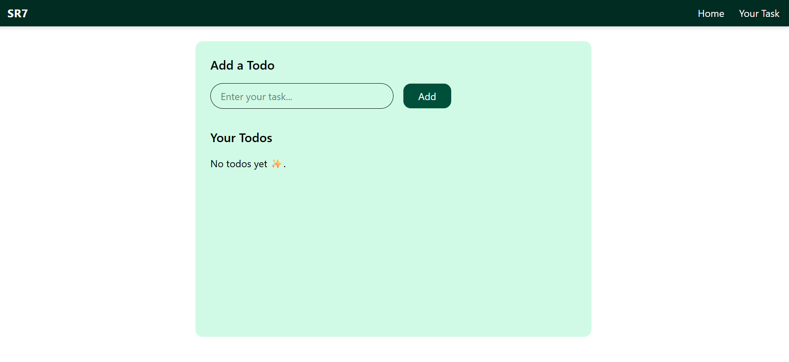
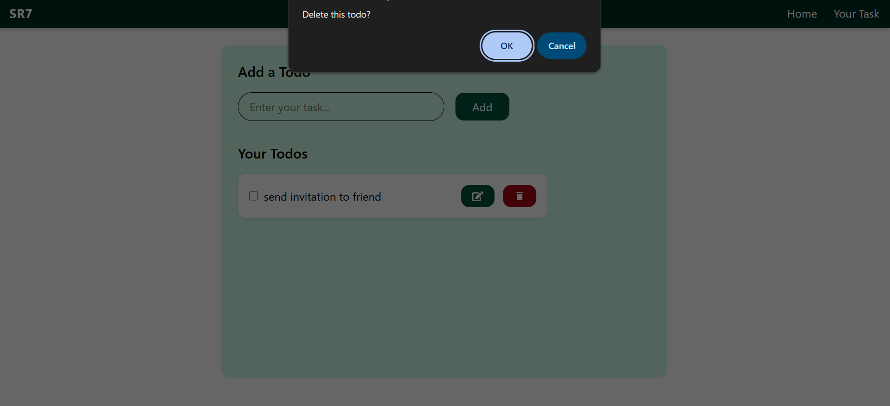

# 📝 Todo List App

A simple, modern Todo List application built with React and Vite.

## Features

- Add, edit, and delete todos
- Mark todos as completed
- Responsive and clean UI
- Todos are saved in your browser (localStorage)


## Screenshots

<p align="center">

  
  
  
</p>

## Getting Started

### Prerequisites
- Node.js (v16 or above recommended)

### Installation
```bash
git clone https://github.com/yourusername/todo-list.git
cd todo-list
npm install
```

### Running the App
```bash
npm run dev
```
Then open [http://localhost:5173](http://localhost:5173) in your browser.

## Project Structure

- `src/` - React components and styles
- `public/` - Static assets
- `index.html` - Main HTML file

## Customization

You can easily change the styles in `App.css` or add new features as you like.

## License

MIT
